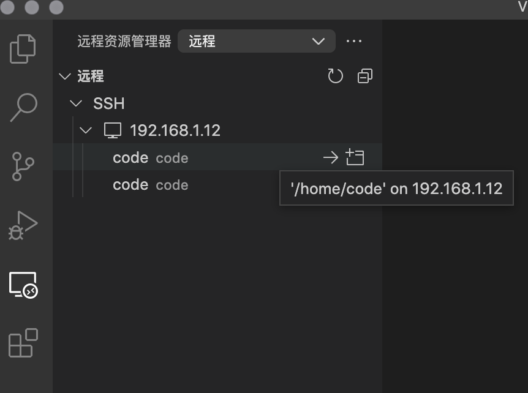
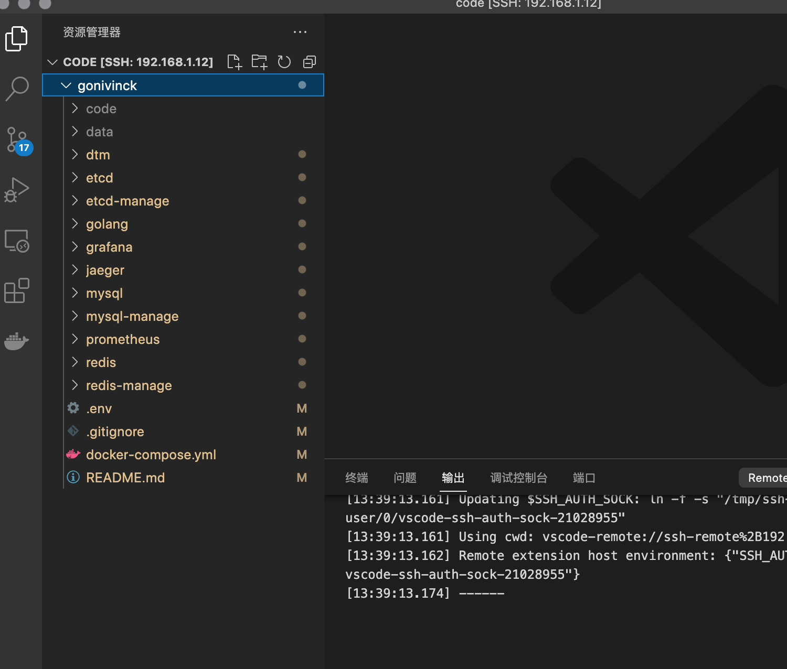
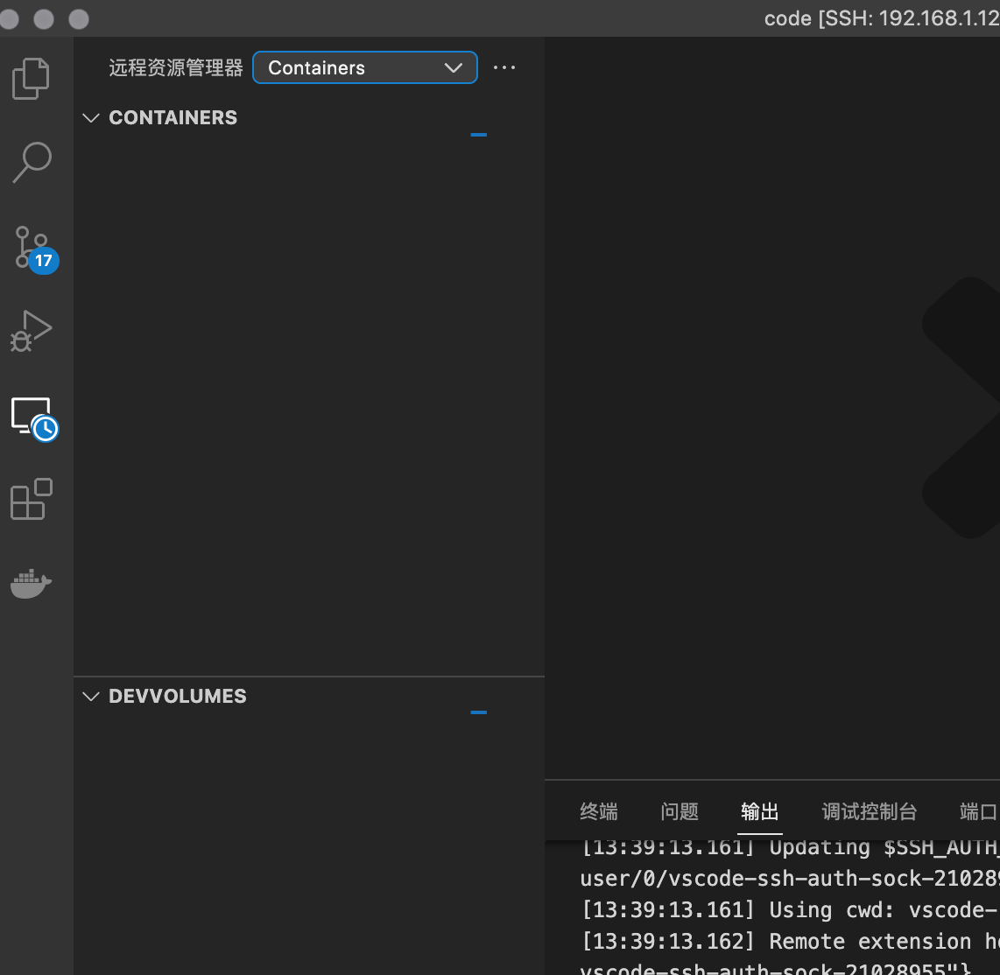
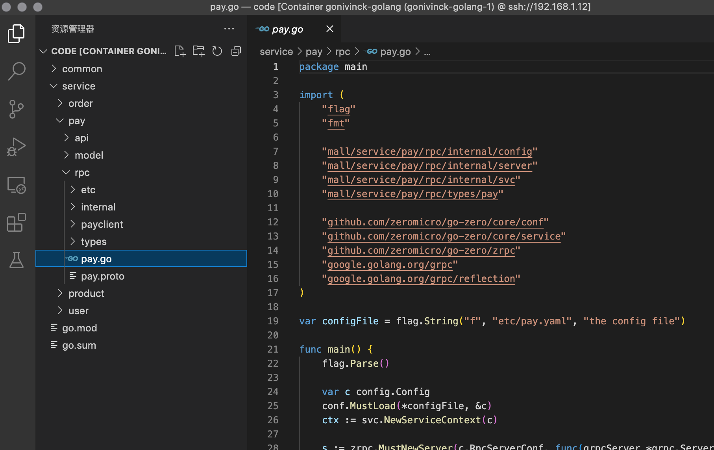

# GolangProjectLearning

> 个人使用go开发学习的记录，国内可以查看[掘金](https://juejin.cn/column/7199193212777676860)

## 目录

[go本地开发环境搭建（了解开发环境搭建）](#go本地开发环境搭建) 

> go-zero单体服务+antd开发后台 开发环境配置

[go-zero单体服务+antd开发后台（环境搭建）](doc/go-zero-antd.md)
+ [Ubuntu环境搭建](doc/go-zero-antd.md#环境搭建) 
+ [Vscode 远程连接设置](#vscode-远程连接设置) 
+ [安装Docker](doc/go-zero-antd.md#安装docker) 
+ [安装docke-compose](doc/go-zero-antd.md#安装docker-compose) 
+ [服务器提交github配置（选看）](doc/go-zero-antd.md#github-ssh配置) 
+ [编写Dockerfile](doc/go-zero-antd.md#编写dockerfile) 
+ [配置golang环境](doc/go-zero-antd.md#配置golang环境) 
+ [安装nodejs](doc/go-zero-antd.md#安装nodejs)
+ [go-zero环境配置](doc/go-zero-antd.md#go-zero环境配置) 
+ [接口demo开发](doc/go-zero-antd.md#tapi-接口开发) 
+ [antdpro demo](doc/go-zero-antd.md#antd-pro-demo)

> 实战开发

[go-zero单体服务（基础功能开发）](doc/go-zero-antd2.md#后台开发实战-2)

+ [目的](doc/go-zero-antd2.md#目的) 
+ [数据库表设计](doc/go-zero-antd2.md#数据库表设计) 
+ [使用gorm gen](doc/go-zero-antd2.md#使用gorm-gen) 
+ [使用gorm gen测试](doc/go-zero-antd2.md#go-zero引入gorm-gen测试) 
+ [修改项目的api文件等配置](doc/go-zero-antd2.md#修改项目的api文件等配置) 
+ [jwt用户登录](doc/go-zero-antd2.md#jwt用户登录) 
+ [错误处理](doc/go-zero-antd2.md#错误处理) 
+ [创建用户](doc/go-zero-antd2.md#创建用户) 
+ [异常处理](doc/go-zero-antd2.md#异常处理) 

> 权限管理

[go-zero单体服务（权限管理）](doc/go-zero-antd3.md#go-zero单体服务权限管理) 
+ [数据库表设计](doc/go-zero-antd3.md#数据库表设计) 
+ [go-zero添加go-redis包](doc/go-zero-antd3.md#go-zero增加redis) 
+ [获取路由URl](doc/go-zero-antd3.md#获取路由url) 
+ [角色表新增，编辑，删除，列表](doc/go-zero-antd3.md#角色表新增编辑删除列表) 
+ [权限资源新增删除列表](doc/go-zero-antd3.md#权限资源新增删除列表) 
+ [角色关联权限资源新增删除](doc/go-zero-antd3.md#角色关联权限资源新增删除) 
+ [用户分配角色](doc/go-zero-antd3.md#用户分配角色) 
+ [增加go-zero权限验证中间件](doc/go-zero-antd3.md#增加go-zero权限验证中间件) 

+ [go-zero单体接口服务总结（源码已上传）](doc/go-zero-antd3.md#go-zero单体接口服务总结) 

> go-zero-antd后台-前端

[go-zero-antd后台-前端部分](doc/go-zero-antd4.md)
+ [项目创建启动](doc/go-zero-antd4.md#项目创建启动)
+ [连接go-zero单体服务接口](doc/go-zero-antd4.md#连接go-zero单体服务接口)
+ [统一处理](doc/go-zero-antd4.md#统一处理)
+ [运行项目](doc/go-zero-antd4.md#运行项目)
+ [antd-pro项目源码](doc/go-zero-antd4.md#antd-pro项目源码)

> go-zero-antd实战

[go-zero-antd实战](doc/go-zero-antd5.md)

+ [前言](doc/go-zero-antd5.md#前言)
+ [项目下载启动](doc/go-zero-antd5.md#项目下载启动)
+ [go-zero学习方法](doc/go-zero-antd6.md)
+ [go-zero添加cobra命令行工具](doc/go-zero-antd7.md#go-zero-antd实战-4go-zero添加cron定时任务)
+ [go-zero添加asynq队列任务](doc/go-zero-antd7.md#go-zero-antd实战-5go-zero添加asynq队列任务)
+ [antd关闭国际化，用户密码加密存储，增加用户退出接口](doc/go-zero-antd8.md#go-zero-antd实战-6antd关闭国际化用户密码加密存储增加用户退出接口)
+ [antd与go-zero放在一个目录下eslint问题，修改用户密码，前后端完整过程整理](doc/go-zero-ant9.md)
+ [golang断言遇到的问题](doc/go-zero-antd10.md)
+ [用户管理antd](doc/go-zero-antd11.md)
+ [资源发布antd，protable编辑单行提交，没有使用editTable](doc/go-zero-antd12.md)
+ [antd用户角色分配权限，antd tree控件，hooks使用【前后端权限管理完结】](doc/go-zero-antd13.md)

> go tcp服务实战

+ [golang tcp服务-1(开始)](doc/gotcp1.md)

## go本地开发环境搭建

> 使用vbox + Ubuntu虚拟机 + docker + docker-compose + vscode远程容器内开发golang

+ 1. vbox安装（自行安装）
+ 2. 使用vbox安装Ubuntu（自行安装）
+ 3. 在Ubuntu中安装docker和docker-compose （自行安装）
+ 4. vscode远程容器内开发golang

### 首先启动docker-compose
    
[goivinck](https://github.com/nivin-studio/gonivinck) 这个是基于go-zero的一个开发环境

### vscode需要安装两个插件

Remote - SSH (这个可以通过ssh远程连接服务器)

Remote Development （这个可以等远程连接完服务器再连接容器）

打开 Remote - SSH 可以看到这个界面，然后新建连接

输入 ssh root@192.168.1.12 -A   -A一定要加不然有问题

进去之后选择打开目录，我这边是已经弄好的，就直接选择一个目录进去即可

这个就是虚拟机中Ubuntu中之前需要使用到的docker-compose的一个目录，记得docker-compose up启动

进入目录之后需要安装好 Remote Development 这个和Remote SSH同一个选项按钮打开后有一个远端资源管理器选择Containers。

这个进去之后会很慢，应该是vscode在配置一些远端资源，实在太慢就关闭重新进入一遍即可

看到这个页面点击Refresh，弹出框输入服务器密码即可（这个页面出来慢，需要多次尝试，暂时没搞清楚原因）

这个已经是远端服务器docker运行的Containers列表了，选择golang的那个进入

至此已经可以编写代码执行go程序了。这个进来之后vscode会让你安装go tools一些插件选择安装即可。

> 这种开发环境对于我来说好处就是不管我是用Windows还是mac来开发都可以使用。这种开发环境配置算是复杂的，如果个人只是单纯需要golang的环境，我建议直接配置好虚拟机之后直接在虚拟机中配置go环境，然后用vscode远程开发即可。看个人喜好。

> 开发环境我个人比较喜欢本地使用虚拟机安装linux之后共享目录，这样代码可以本地编写，运行环境在虚拟机中。这样可以保证我们开发环境尽量贴合生产环境，现在vscode提供了Remote SSH这个插件很好用，我不需要再搞共享目录了，再配合docker可以快速创建统一的开发环境，随时切换都可以。

> 学会了这种开发模式后在允许的情况下可以直接调试线上代码

[go-zero单体服务+antd开发后台](doc/go-zero-antd.md)
一个完整的go+antd的开发学习实战