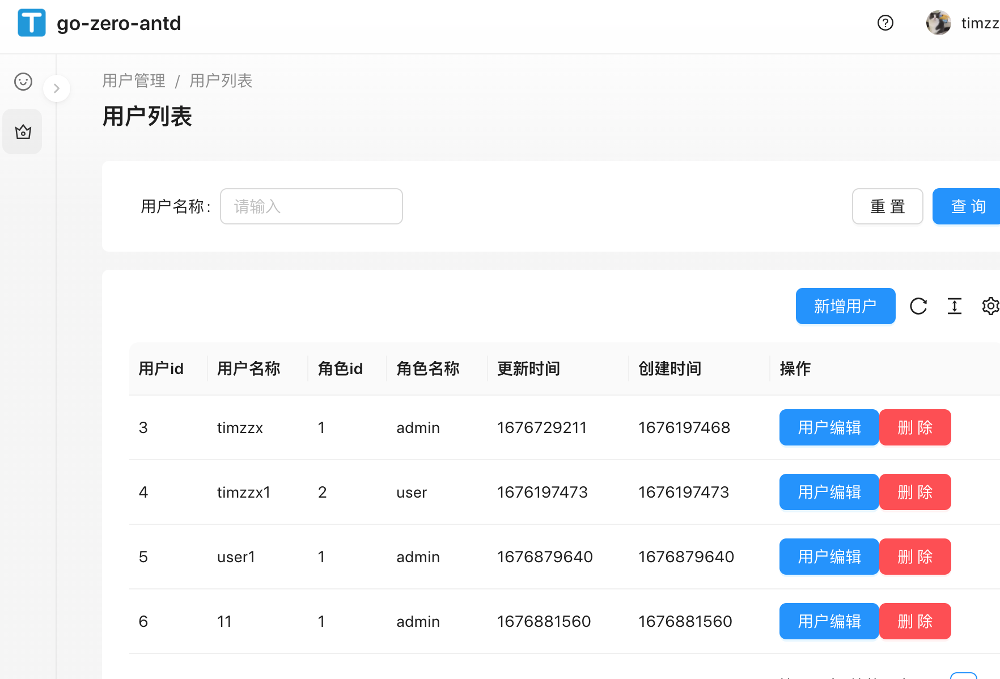

reactjs - 类型 '{}' 缺少类型中的以下属性 - TS 错误
这个要加入?,让属性可选

# go-zero-antd实战-9（用户管理antd）

> go-zero接口文档写过了，这次就只写antd部分

## 功能点

+ 1. 用户列表
+ 2. 用户新增，编辑
+ 3. 用户删除


## 创建page和路由

直接用umi g page UserList --dir生成tsx文件

修改config/routes.ts
```ts
// 用户管理
  {
    path: '/user',
    name: '用户管理',
    icon: 'crown',
    routes: [
      {
        path: '/user/userinfo',
        name: '用户信息',
        component: './User/UserInfo',
      },
      // 新增用户列表
      {
        path: '/user/list',
        name: '用户列表',
        component: './UserList',
      },
    ],
  },
```

## 编辑service，增加userlist需要的api接口请求

修改src/services/tapi/typings.d.ts
```ts
declare namespace TAPI {

    type User = {
        id?: number;
        name?: string;
        role_id?: number;
        role_name?: string;
        ctime?: number;
        utime?: number;
    };
    // 用户列表
    type UserListParams = {
        name?: string;
    };
    type UserListResponse = {
        code?: number;
        msg?: string;
        data?: User[];
    }

    // 用户编辑
    type UserAddParams = {
        id?: number;
        name?: string;
        password?: string;
        role_id?: number;
    }
    type UserAddResponse = {
        code?: number;
        msg?: string;
    }
    // 用户删除
    type UserDelParams = {
        id?: number;
    }
    type UserDelResponse = {
        code?: number;
        msg?: string;
    }
    // 角色
    type Role = {
        id?: number;
        name?: string;
        type?: number;
        ctime?: number;
        utime?: number;
    };
    // 角色列表
    type RoleListResponse = {
        code?: number;
        msg?: string;
        data?: Role[];
    }

}
```

修改web/src/services/tapi/api.ts
```ts
// @ts-ignore
/* eslint-disable */
import { request } from '@umijs/max';

// 修改密码 json提交
export async function userList(body: TAPI.UserListParams | undefined = undefined, options?: { [key: string]: any }) {
    return request<TAPI.UserListResponse>('/api/user/list', {
        method: 'POST',
        headers: {
            'Content-Type': 'application/json',
        },
        data: body,
        ...(options || {}),
    });
}

// 角色列表
export async function roleList() {
    return request<TAPI.RoleListResponse>("/api/role/list", {
        method: "GET",
    });
}

// 用户编辑
export async function userAdd(params: TAPI.UserAddParams) {
    return request<TAPI.UserAddResponse>("/api/user/add", {
        method: "POST",
        params: params,
    });
}

// 用户删除
export async function userDel(params: TAPI.UserDelParams) {
    return request<TAPI.UserDelResponse>("/api/user/del", {
        method: "POST",
        data: params,
    });
}

```

> 这个地方需要注意data和params这两个参数，go-zero接口接收的时候我写了两种一种接收json，一种接收form，

data 对应 json 请求

params 对应 form 请求

## 功能编写

修改 web/src/pages/UserList/index.tsx

```ts
import { ModalForm, PageContainer, ProColumns, ProTable, ProFormText, ProFormSelect } from '@ant-design/pro-components';
import React from 'react';
import { userList, roleList, userAdd, userDel } from '@/services/tapi/api';
import { Button, message } from 'antd';
import { history } from '@umijs/max';
// import styles from './index.less';

// 编辑用户
const UserEdit: React.FC<TAPI.User & { title: string, handleRersh: any }> = (props) => {
  console.log(props)
  const { title, handleRersh } = props
  return (
    <ModalForm
      title={title}
      trigger={<Button type="primary">{title}</Button>}
      onFinish={async (values) => {
        let param: TAPI.UserAddParams = {
          id: values.id || 0,
          name: values.name,
          password: values.password || '',
          role_id: values.role_id,
        }
        let res: TAPI.UserAddResponse = await userAdd(param);
        if (res.code === 200) {
          message.success(title + "成功")
          handleRersh();
          return true;
        }
        message.error(title + "失败")
        return false;
      }}
    >
      <ProFormText
        name="id"
        hidden={true}
        initialValue={props.id || 0}
      />
      <ProFormText
        width="md"
        name="name"
        label="用户名"
        initialValue={props.name || ""}
      />
      <ProFormText
        width="md"
        name="password"
        label="密码"
        placeholder="密码，如果不填入那么就不修改密码"
      />
      <ProFormSelect
        name="role_id"
        label="角色"
        // 选中
        initialValue={props.role_id || 0}
        request={async () => {
          const list = await roleList();
          let data: Array<{ label: string | undefined, value: number | undefined }> = [];
          list.data?.map(vlaue => {
            data.push({
              "label": vlaue.name,
              "value": vlaue.id
            })
            return vlaue
          });
          return data;
        }}
      />
    </ModalForm>
  )
}

const UserList: React.FC = () => {
  const handleRersh = () => {
    history.go(0);
  }
  const handleDel = async (id: number | undefined) => {
    let params = {
      id: id,
    };
    let data = await userDel(params)
    if (data?.code === 200) {
      message.info("删除成功");
    } else {
      message.info("删除失败");
    }
    handleRersh();
  }

  const columns: ProColumns<TAPI.User>[] = [
    {
      title: '用户id',
      dataIndex: 'id',
      hideInSearch: true,
    },
    {
      title: '用户名称',
      dataIndex: 'name',
    },
    {
      title: '角色id',
      dataIndex: 'role_id',
      hideInSearch: true,
    },
    {
      title: '角色名称',
      dataIndex: 'role_name',
      hideInSearch: true,
    },
    {
      title: '更新时间',
      dataIndex: 'utime',
      hideInSearch: true,
    },
    {
      title: '创建时间',
      dataIndex: 'ctime',
      hideInSearch: true,
    },
    {
      title: "操作",
      hideInSearch: true,
      render: (text, record) => [
        <UserEdit key="edit" title="用户编辑" handleRersh={handleRersh} {...record} />,
        <Button key="2" type="primary" danger onClick={() => { handleDel(record.id) }}>删除</Button>,
      ],
    },
  ];


  return (
    <div>
      <PageContainer>
        <ProTable
          columns={columns}
          // 使用id作为key,这个key是字符串所以要转换一下
          rowKey={record => record.id?.toLocaleString() || ""}
          // 设置分页数据
          pagination={{
            pageSize: 20,
            onChange: (page) => console.log(page),
          }}
          // 数据获取，没有分页查询。分页是前端做的
          request={async (params) => {
            console.log(params)
            const UserListParams: TAPI.UserListParams = {
              name: params.name || '',
            };
            const d = await userList(UserListParams);
            return Promise.resolve({
              data: d.data,
              success: true,
            });
          }}
          toolBarRender={() => [
            <UserEdit key="edit" title="新增用户" handleRersh={handleRersh} />,
          ]}
        ></ProTable>

      </PageContainer>
    </div >
  );
}

export default UserList;

```

> 这里要注意columns中的render 
```ts
<Button key="2" type="primary" danger onClick={() => { handleDel(record.id) }}>删除</Button>
```
这里的onclick直接调用handleDel方法，会导致页面刷新的时候自动执行每条的这个方法，所以这里要用()=>{}包裹一下，具体原因暂时未去查询。

展示


