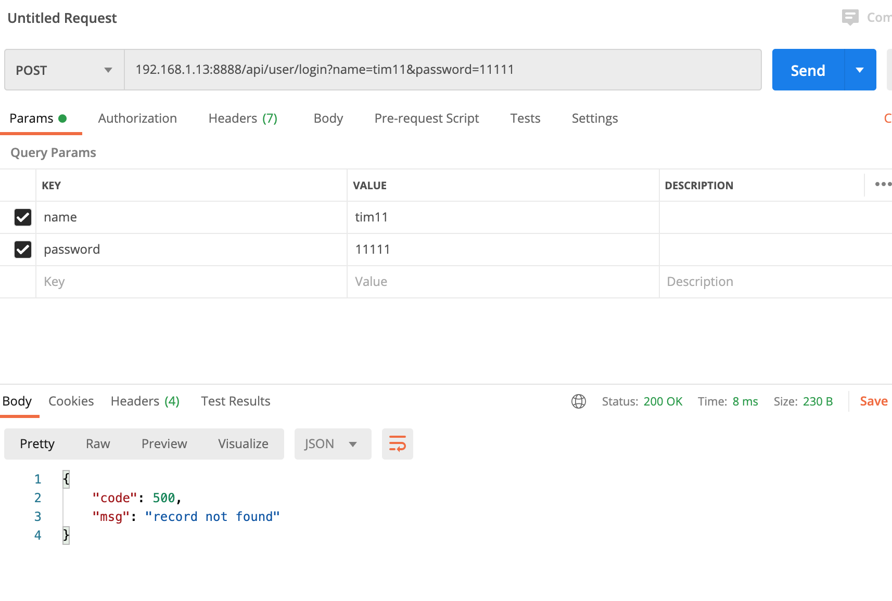

# 后台开发实战-2

## 目录

[返回-全部目录](../README.md#目录)<br />
[待办列表](#待办列表)<br />
[目的](#目的)<br />
[数据库表设计](#数据库表设计)<br />
[使用gorm gen](#使用gorm-gen)<br />
[使用gorm gen测试](#go-zero引入gorm-gen测试)<br />

## 待办列表

- [x] 目的  
- [ ] 设计数据库表
- [ ] go-zero api
- [ ] antd pro 配合 go-zero

## 目的

> 完成基于go-zero单体服务+antd pro后台，登录，用户管理，权限管理

> 尽量展示开发过程遇到的问题，并解决，不会为了排版就把问题提前，什么时候遇到什么时候展示解决。

## 数据库表设计

1. 基于[GoDockerDev](https://github.com/timzzx/GoDockerDev)启动mysql，redis

```
// 创建compose目录
mkdir dev_compose

// 下载GoDockerDev
git clone https://github.com/timzzx/GoDockerDev.git

cd GoDockerDev/

// 启动docker-compose
docker-compose up -d

// 显示
root@tdev:/home/code/dev_compose/GoDockerDev# docker-compose up -d
[+] Running 2/2
 ⠿ Container godockerdev-redis-1  Started                                                    1.1s
 ⠿ Container godockerdev-mysql-1  Started                                                    1.0s
```

创建bk数据库并且创建user表

```sql
CREATE TABLE `user` (
  `id` bigint(20) unsigned zerofill NOT NULL AUTO_INCREMENT COMMENT '用户表主键',
  `name` varchar(128) NOT NULL COMMENT '用户名',
  `password` varchar(64) NOT NULL COMMENT '密码',
  `status` int(11) NOT NULL DEFAULT '1' COMMENT '是否有效1.有效 2.无效',
  `ctime` int(11) NOT NULL DEFAULT '0' COMMENT '创建时间',
  `utime` int(11) DEFAULT NULL COMMENT '更新时间',
  PRIMARY KEY (`id`)
) ENGINE=InnoDB DEFAULT CHARSET=utf8mb4 COMMENT='用户表'
```

## 使用gorm gen

安装生成
```
// 安装Gen Tool
go install gorm.io/gen/tools/gentool@latest

// 报错了
cgo: C compiler "gcc" not found: exec: "gcc": executable file not found in $PATH

// 安装Ubuntu开发包(省事)
sudo apt install build-essential

// 再次安装Gen Tool
go install gorm.io/gen/tools/gentool@latest

cd tapi/
mkdir bkmodel

// 生成gen
gentool -dsn "root:123456@tcp(192.168.1.13:3306)/bk?charset=utf8mb4&parseTime=True&loc=Local" -outPath "./bkmodel/dao/query"

// 更新依赖
go mod tidy

```

> 注意 -outPath "./bkmodel/dao/query" 能改变的只能是bkmodel这个目录，后面的是固定的。

> 测试表增加一个字段，增加一张表，重新执行命令后新的表和字段都会生成。bkmodel下所有文件都不要修改直接使用就好

创建makefile
```
# 命令
gen:
	gentool -dsn "root:123456@tcp(192.168.1.13:3306)/bk?charset=utf8mb4&parseTime=True&loc=Local" -outPath "./bkmodel/dao/query"
```

make gen运行展示
```
root@tdev:/home/code/tapi# make gen
gentool -dsn "root:123456@tcp(192.168.1.13:3306)/bk?charset=utf8mb4&parseTime=True&loc=Local" -outPath "./bkmodel/dao/query"
2023/02/11 07:19:53 got 6 columns from table <user>
2023/02/11 07:19:53 Start generating code.
2023/02/11 07:19:53 generate model file(table <user> -> {model.User}): /home/code/tapi/bkmodel/dao/model/user.gen.go
2023/02/11 07:19:53 generate query file: /home/code/tapi/bkmodel/dao/query/user.gen.go
2023/02/11 07:19:53 generate query file: /home/code/tapi/bkmodel/dao/query/gen.go
2023/02/11 07:19:53 Generate code done.
```

时区有问题改一下
```
sudo timedatectl set-timezone Asia/Shanghai

// 检查
root@tdev:/home/code/tapi# sudo timedatectl set-timezone Asia/Shanghai
root@tdev:/home/code/tapi# timedatectl
               Local time: Sat 2023-02-11 15:31:07 CST
           Universal time: Sat 2023-02-11 07:31:07 UTC
                 RTC time: Sat 2023-02-11 07:31:07
                Time zone: Asia/Shanghai (CST, +0800)
System clock synchronized: yes
              NTP service: active
          RTC in local TZ: no
```

## go-zero引入gorm gen

> 说明一下，go-zero的orm封装的比较简单，虽然带cahce的封装，不过这个功能对于后台来说不需要，反而后台涉及统计sql比较复杂，所以改用gorm。

增加make命令,编辑makefile

```
gen_api:
	goctl api go -api project.api -dir ./
dev:
	go run user.go -f etc/user.yaml
```

运行项目看看
```
go run user.go -f etc/user.yaml
Starting server at 0.0.0.0:8888...
```

增加Mysql配置，修改etc/user.yaml
```
Name: User
Host: 0.0.0.0
Port: 8888

Mysql:
  DataSource: root:123456@tcp(192.168.1.13:3306)/bk?charset=utf8mb4&parseTime=true&loc=Asia%2FShanghai
```

修改tapi/internal/config/config.go
```go
package config

import "github.com/zeromicro/go-zero/rest"

type Config struct {
	rest.RestConf

	Mysql struct {
		DataSource string
	}
}

```
修改tapi/internal/svc/servicecontext.go
```go
package svc

import (
	"tapi/bkmodel/dao/query"
	"tapi/internal/config"

	"gorm.io/driver/mysql"
	"gorm.io/gorm"
)

type ServiceContext struct {
	Config config.Config

	BkModel *query.Query
}

func NewServiceContext(c config.Config) *ServiceContext {
	db, _ := gorm.Open(mysql.Open(c.Mysql.DataSource), &gorm.Config{})
	return &ServiceContext{
		Config:  c,
		BkModel: query.Use(db),
	}
}

```
修改tapi/internal/logic/loginlogic.go
```go
package logic

import (
	"context"

	"tapi/internal/svc"
	"tapi/internal/types"

	"github.com/zeromicro/go-zero/core/logx"
)

type LoginLogic struct {
	logx.Logger
	ctx    context.Context
	svcCtx *svc.ServiceContext
}

func NewLoginLogic(ctx context.Context, svcCtx *svc.ServiceContext) *LoginLogic {
	return &LoginLogic{
		Logger: logx.WithContext(ctx),
		ctx:    ctx,
		svcCtx: svcCtx,
	}
}

func (l *LoginLogic) Login(req *types.LoginRequest) (resp *types.LoginResponse, err error) {
	// todo: add your logic here and delete this line
	table := l.svcCtx.BkModel.User
	user, err := table.WithContext(l.ctx).Where(table.Name.Eq(req.Name)).Debug().First()

	if err != nil {

		return &types.LoginResponse{
			Code: 500,
			Msg:  err.Error(),
		}, nil
	}

	return &types.LoginResponse{
		Code: 200,
		Msg:  user.Name,
	}, nil
}

```

## go-zero引入gorm gen测试

插入一条数据
```sql
INSERT INTO `user` VALUES ('1', 'tim', '123456', '1', '0', '0');
```

运行项目
```
make dev

// 返回
go run user.go -f etc/user.yaml
Starting server at 0.0.0.0:8888...
```
打开postman访问

name 发送tim11 是个错误的，所以返回没有记录。

正确返回

> debug选项要注意一下
``` go
// debug在这里，去掉就不会输出sql语句注意一下
user, err := table.WithContext(l.ctx).Where(table.Name.Eq(req.Name)).Debug().First()

```


```
// console 输出正确的信息
2023/02/11 17:15:07 /home/code/tapi/bkmodel/dao/query/user.gen.go:234
[0.784ms] [rows:1] SELECT * FROM `user` WHERE `user`.`name` = 'tim' ORDER BY `user`.`id` LIMIT 1

// console 输出错误的信息
2023/02/11 17:11:32 /home/code/tapi/bkmodel/dao/query/user.gen.go:234 record not found
[0.908ms] [rows:0] SELECT * FROM `user` WHERE `user`.`name` = 'tim11' ORDER BY `user`.`id` LIMIT 1

```