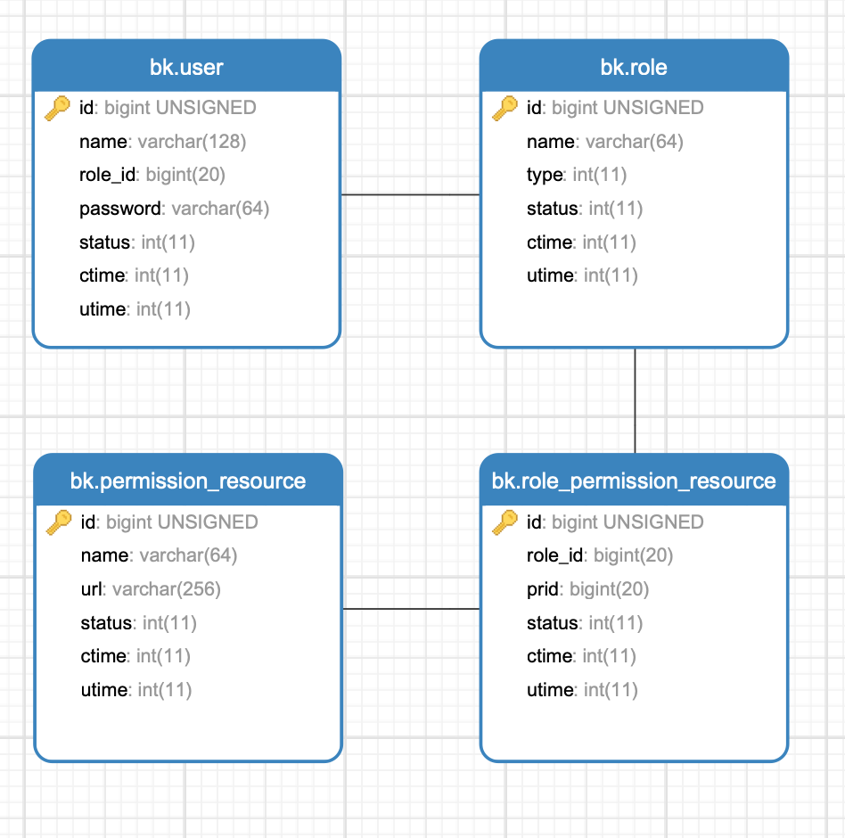

# go-zero单体服务（权限管理）

> 基于tapi项目[文档地址](go-zero-antd2.md#后台开发实战-2)，可以使用casbin做权限管理，为了多练习使用go-zero本文档从零开发权限管理

## 目录

[数据库表设计](#数据库表设计)
[go-zero添加go-redis包](#go-zero增加redis)
[获取路由URl](#获取路由url)

## 数据库表设计

创建role表
```sql
CREATE TABLE `role` (
  `id` bigint(20) unsigned zerofill NOT NULL AUTO_INCREMENT COMMENT '角色表',
  `name` varchar(64) NOT NULL DEFAULT '' COMMENT '角色名',
  `type` int(11) NOT NULL DEFAULT '1' COMMENT '1.普通用户，2.管理员',
  `status` int(11) NOT NULL DEFAULT '1' COMMENT '1.有效，2.无效',
  `ctime` int(11) NOT NULL DEFAULT '0' COMMENT '创建时间',
  `utime` int(11) NOT NULL DEFAULT '0' COMMENT '更新时间',
  PRIMARY KEY (`id`)
) ENGINE=InnoDB DEFAULT CHARSET=utf8mb4 COMMENT='角色表'
```
权限资源表
```sql
CREATE TABLE `permission_resource` (
  `id` bigint(20) unsigned zerofill NOT NULL AUTO_INCREMENT COMMENT '权限资源表主键',
  `name` varchar(64) NOT NULL DEFAULT '' COMMENT '资源名称',
  `url` varchar(256) NOT NULL DEFAULT '' COMMENT '资源url',
  `status` int(11) NOT NULL DEFAULT '1' COMMENT '1.有效，2.无效',
  `ctime` int(11) NOT NULL DEFAULT '0' COMMENT '创建时间',
  `utime` int(11) NOT NULL DEFAULT '0' COMMENT '更新时间',
  PRIMARY KEY (`id`)
) ENGINE=InnoDB DEFAULT CHARSET=utf8mb4 COMMENT='权限资源表'
```
角色权限资源关联表表
```sql
CREATE TABLE `role_permission_resource` (
  `id` bigint(20) unsigned zerofill NOT NULL AUTO_INCREMENT COMMENT '角色和权限资源关联表主键',
  `role_id` bigint(20) NOT NULL DEFAULT '0' COMMENT '角色id',
  `prid` bigint(20) NOT NULL DEFAULT '0' COMMENT '权限资源id',
  `status` int(11) NOT NULL DEFAULT '1' COMMENT '1.有效，2.无效',
  `ctime` int(11) NOT NULL DEFAULT '0' COMMENT '创建时间',
  `utime` int(11) NOT NULL DEFAULT '0' COMMENT '更新时间',
  PRIMARY KEY (`id`)
) ENGINE=InnoDB DEFAULT CHARSET=utf8mb4 COMMENT='角色和权限资源关联表'
```
用户表增加role_id字段，关联角色表
```sql
CREATE TABLE `user` (
  `id` bigint(20) unsigned zerofill NOT NULL AUTO_INCREMENT COMMENT '用户表主键',
  `name` varchar(128) NOT NULL COMMENT '用户名',
  `role_id` bigint(20) NOT NULL DEFAULT '0' COMMENT '角色id',
  `password` varchar(64) NOT NULL COMMENT '密码',
  `status` int(11) NOT NULL DEFAULT '1' COMMENT '是否有效1.有效 2.无效',
  `ctime` int(11) NOT NULL DEFAULT '0' COMMENT '创建时间',
  `utime` int(11) NOT NULL COMMENT '更新时间',
  PRIMARY KEY (`id`)
) ENGINE=InnoDB DEFAULT CHARSET=utf8mb4 COMMENT='用户表'
```

这个model显示高亮截图不好弄，只能这样

### 生成gen代码

```
make db
```

## go-zero增加redis

> 使用go-redis

修改 etc/backend.yaml
```yaml
...
# 增加redis配置（测试环境没有密码就不加了）
Redis:
  Host: 192.168.1.13:6379
  Type: node
```

修改 internal/config/config.go

```go
// 增加
Redis struct {
		Host string
		Type string
}
```

修改 internal/svc/servicecontext.go
```go
package svc

import (
	"tapi/bkmodel/dao/query"
	"tapi/internal/config"

	"github.com/redis/go-redis/v9"
	"gorm.io/driver/mysql"
	"gorm.io/gorm"
)

type ServiceContext struct {
	Config config.Config

	BkModel *query.Query

	Redis *redis.Client
}

func NewServiceContext(c config.Config) *ServiceContext {
	db, _ := gorm.Open(mysql.Open(c.Mysql.DataSource), &gorm.Config{})
	rdb := redis.NewClient(&redis.Options{
		Addr:     c.Redis.Host,
		Password: "", // no password set
		DB:       0,  // use default DB
	})
	return &ServiceContext{
		Config:  c,
		BkModel: query.Use(db),
		Redis:   rdb,
	}
}

```
go-redis添加完成

## 获取路由url

新建api/routers.api
```go
type (
    RouterListResquest {
		
    }
    Router {
        Method  string `json:"method"`
		Path    string  `json:"path"`
    }
    RouterListResponse {
        Code int64 `json:"code"`
        Msg string  `json:"msg"`
        Data []Router   `json:"data,optional"`
    }

)
```
编辑project.api
```go
syntax = "v1"

info(
	title: "tapi"
	desc: "接口"
	author: "tim"
	version: 1.0
)
// 新增
import "./api/routers.api"

type (
  ...
  
```

```go
service Backend {
	// 用户信息
	@handler UserInfo
	post /api/user/info(UserInfoRequest) returns (UserInfoResponse)
	
	// 创建用户
	@handler UserAdd
	post /api/user/add(UserAddRequest) returns (UserAddResponse)
	
	// 获取路由列表   新增
	@handler RouterList
	get /api/router/list(RouterListResquest) returns (RouterListResponse)
	
}
```
运行make api  发现报错了 make: 'api' is up to date.

修改makefile
```makefile
# 命令
help:
	@echo 'Usage:'
	@echo '     db 生成sql执行代码'
	@echo '     api 根据api文件生成go-zero api代码'
	@echo '     dev 运行'
db:
	gentool -dsn 'root:123456@tcp(192.168.1.13:3306)/bk?charset=utf8mb4&parseTime=True&loc=Local' -outPath './bkmodel/dao/query'
# 增加这一句
.PHONY:api 
api:
	goctl api go -api project.api -dir ./ -style gozero
dev:
	go run backend.go -f etc/backend.yaml
```
重新运行 make api 生成代码

> go-zero获取路由列表通过阅读源码得知rest/server.go中
```go
func (s *Server) Routes() []Route {
	var routes []Route

	for _, r := range s.ngin.routes {
		routes = append(routes, r.routes...)
	}

	return routes
}
```
由于没找到在handler中直接获取路由列表，那么直接在backend.go中直接调用存入一个全局变量中，再利用

新建common/varx/vars.go
```go
package varx

import "github.com/zeromicro/go-zero/rest"

var RouterList []rest.Route

```
然后在backend.go增加
``` go
package main

import (
	"context"
	"flag"
	"fmt"
	"log"
	"net/http"
	"runtime/debug"

	"tapi/common/varx"
	"tapi/internal/config"
	"tapi/internal/handler"
	"tapi/internal/svc"
	"tapi/internal/types"

	"github.com/zeromicro/go-zero/core/conf"
	"github.com/zeromicro/go-zero/rest"
	"github.com/zeromicro/go-zero/rest/httpx"
)

var configFile = flag.String("f", "etc/backend.yaml", "the config file")

func main() {
	flag.Parse()

	var c config.Config
	conf.MustLoad(*configFile, &c)

	server := rest.MustNewServer(c.RestConf)
	defer server.Stop()

	ctx := svc.NewServiceContext(c)
	handler.RegisterHandlers(server, ctx)

	httpx.SetErrorHandlerCtx(func(ctx context.Context, err error) (int, interface{}) {
		fmt.Println(err.Error())
		return http.StatusOK, &types.CodeErrorResponse{
			Code: 500,
			Msg:  err.Error(),
		}
	})

	// 全局recover中间件
	server.Use(func(next http.HandlerFunc) http.HandlerFunc {
		return http.HandlerFunc(func(w http.ResponseWriter, r *http.Request) {
			defer func() {
				if result := recover(); result != nil {
					log.Println(fmt.Sprintf("%v\n%s", result, debug.Stack()))
					httpx.OkJson(w, &types.CodeErrorResponse{
						Code: 500,
						Msg:  "服务器错误", //string(debug.Stack()),
					})
				}
			}()

			next.ServeHTTP(w, r)
		})
	})
	// 路由列表  增加这一句
	varx.RouterList = server.Routes()

	fmt.Printf("Starting server at %s:%d...\n", c.Host, c.Port)
	server.Start()
}

```

修改internal/logic/routerlistlogic.go
```go
package logic

import (
	"context"

	"tapi/common/varx"
	"tapi/internal/svc"
	"tapi/internal/types"

	"github.com/zeromicro/go-zero/core/logx"
)

type RouterListLogic struct {
	logx.Logger
	ctx    context.Context
	svcCtx *svc.ServiceContext
}

func NewRouterListLogic(ctx context.Context, svcCtx *svc.ServiceContext) *RouterListLogic {
	return &RouterListLogic{
		Logger: logx.WithContext(ctx),
		ctx:    ctx,
		svcCtx: svcCtx,
	}
}

func (l *RouterListLogic) RouterList(req *types.RouterListResquest) (resp *types.RouterListResponse, err error) {
	// todo: add your logic here and delete this line
	list := varx.RouterList
	if list == nil {
		return &types.RouterListResponse{
			Code: 500,
			Msg:  "获取失败",
		}, nil
	}

	var data []types.Router

	for _, item := range list {
		d := types.Router{
			Method: item.Method,
			Path:   item.Path,
		}
		if d.Path != "/api/login" {
			data = append(data, d)
		}
	}

	return &types.RouterListResponse{
		Code: 200,
		Msg:  "成功",
		Data: data,
	}, nil
}

```
执行 make dev 访问192.168.1.13:8888/api/router/list
```json
{
    "code": 200,
    "msg": "成功",
    "data": [
        {
            "method": "POST",
            "path": "/api/user/info"
        },
        {
            "method": "POST",
            "path": "/api/user/add"
        },
        {
            "method": "GET",
            "path": "/api/router/list"
        }
    ]
}
```
